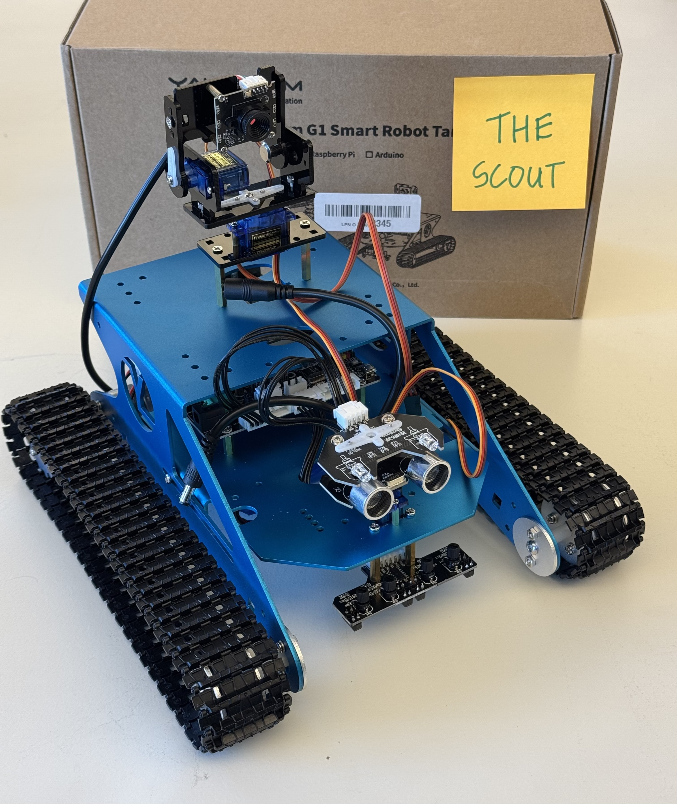

# The Scout

## Prompt

Build an autonomous vehicle utilizing at least the following components:

- Camera
- Ultrasonic sensor
- All servo motors

## Vehicle

<table>
    <tr>
        <th></th>
        <th></th>
    </tr>
    <tr>
        <td>Name</td>
        <td>Yahboom RPi G1 Tank</td>
    </tr>
    <tr>
        <td>Product Link</td>
        <td><a href="http://www.yahboom.net/study/G1-T-PI">http://www.yahboom.net/study/G1-T-PI</a></td>
    </tr>
    <tr>
        <td>Assembly Instructions</td>
        <td><a href="https://drive.google.com/drive/folders/1bulGuPivJVSwmayscKBEYNGKkOzXupJV?usp=sharing">https://drive.google.com/drive/folders/1bulGuPivJVSwmayscKBEYNGKkOzXupJV?usp=sharing</a></td>
    </tr>
</table>

### Getting Started

- Complete all the instructions from the assembly instructions tutorial. d
- **Do NOT** run scripts in the **yahboom_provided_source_code**, use it only for reference. The physical pin numbers have changed. Running these scripts could damage your raspberry pi.
- Use the code in the **src** folder to run your vehicle. Run the `test_<item>.py` scripts to get started.
